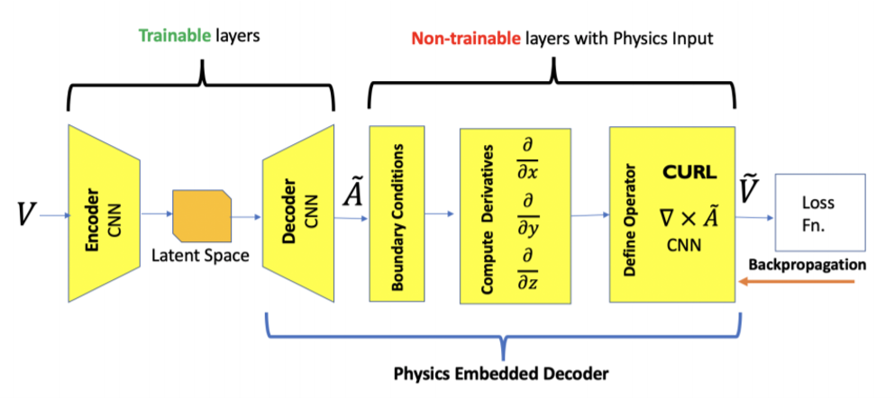

---
search:
  boost: 2 
---
Sapsan has several models in its arsenal to get started.

## Convolution Neural Network (CNN)

{ align=right : style="width:200px"}
{ align=right : style="width:200px"}

Example: [cnn_example.ipynb](https://github.com/pikarpov-LANL/Sapsan/blob/master/sapsan/examples/cnn_example.ipynb) <br>
Estimator: [cnn3d_estimator.py](https://github.com/pikarpov-LANL/Sapsan/blob/master/sapsan/lib/estimator/cnn/cnn3d_estimator.py)

The network is based around [Conv3d](https://pytorch.org/docs/stable/generated/torch.nn.Conv3d.html) and [MaxPool3d](https://pytorch.org/docs/stable/generated/torch.nn.MaxPool3d.html#maxpool3d) layers, reducing the spatial dimensions down to 1 by increasing the number of _features_. In order to do that, the network iterates over the following NN block:

```python
def nn_block():
  torch.nn.Conv3d(D_in, D_in*2, kernel_size=2, stride=2, padding=1)
  torch.nn.MaxPool3d(kernel_size=2, padding=1)
```
where _D_in_ is the input dimension.

As final layers, [ReLU](https://pytorch.org/docs/stable/generated/torch.nn.ReLU.html) activation function is used and the data is [linearized](https://pytorch.org/docs/stable/generated/torch.nn.Linear.html). An example model graph for the input data with the spatial dimensions of [16, 16, 16] split into 8 batches is provided below.

## Kernel Ridge Regression (KRR)

Example: [krr_example.ipynb](https://github.com/pikarpov-LANL/Sapsan/blob/master/sapsan/examples/krr_example.ipynb) <br>
Estimator: [krr_estimator.py](https://github.com/pikarpov-LANL/Sapsan/blob/master/sapsan/lib/estimator/krr/krr_estimator.py)

We have included one of the classic regression-based methods used in machine learning - [Kernel Ridge Regression](https://scikit-learn.org/stable/modules/generated/sklearn.kernel_ridge.KernelRidge.html). The model has two hyperparameters to be tuned: regularization term `α` and full-width at half-max `σ`. KRR has the following form:

$$
y^′ = y(K + \alpha I)^{− 1}k
$$

where *K* is the kernel, chosen to be the radial basis function (gaussian):

$$
K(x, x^′) = exp\left( -\frac{||x − x^′||^2}{2\sigma^2}\right)
$$

## Physics-Informed CNN for Turbulence Modeling (PIMLTurb)

{ align=right : style="width:200px"}
{ align=right : style="width:200px"}

*[Accepted 2022, Astrophysical Journal (ApJ)](https://arxiv.org/abs/2205.08663)*

Example: [pimlturb_diagonal_example.ipynb](https://github.com/pikarpov-LANL/Sapsan/blob/master/sapsan/examples/pimlturb_diagonal_example.ipynb) <br>
Estimator: [pimlturb_diagonal_estimator.py](https://github.com/pikarpov-LANL/Sapsan/blob/master/sapsan/lib/estimator/pimlturb/pimlturb_diagonal_estimator.py)

The estimator is based on [Physics-Informed Machine Learning for Modeling Turbulence in Supernovae](https://arxiv.org/abs/2205.08663) by P.I.Karpov et al. The model is based on a 3D convolutional network with some additions to enforce a realizability constraint (*Re*<sub>*ii*</sub> > 0, where *Re* is the Reynolds stress tensor and *i* is the component index). Its overall schematic and graph are shown below.

The method also utilizes a custom loss that combines statistical (Kolmogorov-Smirnov Statistic) and spatial (Smooth L1) losses. The full description can be found in the paper linked above.

For the example included in Sapsan, the data included is from the same dataset as the publication, but it has been heavily sampled (down to 17^3^). To achieve comparable published results, the model will need to be trained for 3000-4000 epochs. 

{style="width:400px"}
{style="width:400px"}

## Physics-Informed Convolutional Autoencoder (PICAE)

Example: [picae_example.ipynb](https://github.com/pikarpov-LANL/Sapsan/blob/master/sapsan/examples/picae_example.ipynb) <br>
Estimator: [picae_estimator.py](https://github.com/pikarpov-LANL/Sapsan/blob/master/sapsan/lib/estimator/picae/picae_estimator.py)

*Note: The estimator is based on [Embedding Hard Physical Constraints in Neural Network Coarse-Graining of 3D Turbulence](https://ui.adsabs.harvard.edu/abs/2020arXiv200200021M) by M.T.Arvind et al.*

The model consists of 2 main parts:
1. Convolutional Auto-Encoder (trainable)
2. Static layers enforcing divergence-free condition (constant)

Thus, the latter force the CAE portion of the model to adjust to the curl of A to be 0. Through this, we are effectively enforcing the conservation of mass. A schematic of the model is shown below.

{style="width:600px"}